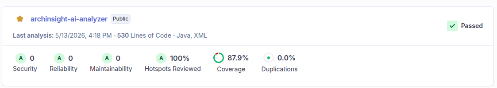

# 🛠 API de Processar Analise de Diagrama AI

[](https://openjdk.org/)
[](https://spring.io/projects/spring-boot)
[](https://www.postgresql.org/)
[](https://www.docker.com/)
[](https://kubernetes.io/)
[](https://aws.amazon.com/eks/)
[](https://github.com/thomaserick/gerenciador-oficina-core-fase-2/actions/workflows/pipeline.yml)

API para processar analise de diagrama AI.

## 📋 Índice

- [Tecnologias](#-tecnologias)
- [CI/CD Pipeline](#-cicd-pipeline--github-actions)
- [Kubernetes (EKS)](#-kubernetes-eks)
- [Instalação Local](#-instalação-local)
- [Repositórios Relacionados](#-repositórios-relacionados--fase-4)

## 🛠 Tecnologias

- **Java 17+** - Linguagem principal
- **Spring Boot 3.3** - Framework backend
- **JPA/Hibernate**
- **DynamoDB** - Banco de dados
- **Docker** - Containerização
- **Flyway** - Migrações de banco
- **OpenAPI/Swagger** - Documentação APIs
- **Mockito** - Testes unitários
- **GitHub Actions** - Automação CI/CD
- **SonarQube** - Análise de qualidade e cobertura de código
- **RabbitMQ** - Fila de mensagens para comunicação assíncrona

📝 Diagrama de arquitetura da aplicação:


## 🚀 CI/CD Pipeline – GitHub Actions

Esta pipeline automatiza o processo de build, teste, análise, empacotamento e deploy da aplicação para o AWS EKS.
Ela é executada automaticamente em eventos de push na branch main.


### Analise SonarQube

A pipeline inclui um job dedicado para análise de código com o SonarQube, garantindo a qualidade do código e a cobertura
de testes. O job é configurado para autenticar usando um token seguro armazenado nos GitHub Secrets,
e utiliza o plugin Maven do SonarQube para enviar os resultados da análise.



### Variaveis de Ambiente

A pipeline utiliza as seguintes variáveis de ambiente armazenadas como Secrets no GitHub:

| Nome                  | Descrição                              |
|-----------------------|----------------------------------------|
| SONAR_TOKEN           | Token de autenticação para o SonarQube |
| DOCKERHUB_USERNAME    | Nome de usuário do Docker Hub          |
| DOCKERHUB_TOKEN       | Token de acesso do Docker Hub          |
| AWS_ACCESS_KEY_ID     | Chave de acesso AWS                    |
| AWS_SECRET_ACCESS_KEY | Chave secreta AWS                      |

### 🔨 Job: Build

Responsável por compilar o projeto e gerar o artefato `.jar`.

- Faz checkout do código fonte.
- Executa em um container Ubuntu com Java 17 e Maven pré-instalados.
- Executa o comando: - mvn -B clean package -DskipTests
- Faz upload do artefato gerado `(target/*.jar)` para ser reutilizado nos próximos jobs.

### ✅ Job: test

Executa os testes unitários:

- Faz checkout do código.
- Configura o Java 17.
- Executa `mvn test` para validar o código antes de seguir.

### 🔍 Job: SonarQube Analysis

Realiza a análise estática de código com o SonarQube:

- Faz checkout e configuração Java.
- Utiliza cache do SonarQube para otimizar execução.
- Executa:`
mvn -B verify org.sonarsource.scanner.maven:sonar-maven-plugin:sonar \
Dsonar.projectKey=thomaserick_archinsight-ai-analyzer
`
- Autenticação via SONAR_TOKEN armazenado nos GitHub Secrets.

### 🐳 Job: docker

Cria e publica a imagem Docker da aplicação:

- Faz download do artefato .jar gerado no job Build.
- Faz login no Docker Hub usando secrets (DOCKERHUB_USERNAME e DOCKERHUB_TOKEN).
- Configura o ambiente Docker Buildx.
- Constrói e envia a imagem para o Docker Hub com as tags:
    - latest
    - run_number (versão incremental da execução da pipeline)
- Publica em: `docker.io/<usuario-dockerhub>/archinsight-ai-analyzer`

### ☁️ Job: aws-deploy

Realiza o deploy automático no AWS EKS:

- Configura credenciais da AWS `(via AWS_ACCESS_KEY_ID_DEV e AWS_SECRET_ACCESS_KEY_DEV)`.
- Instala e configura o kubectl.
- Atualiza o kubeconfig para o cluster EKS
- Configurar o banco de dados DynamoDb na AWS
- Executa o script `./devops/scripts/deploy-prod-k8s.sh
` para aplicar as configurações Kubernetes.

## ☸️ Kubernetes (EKS)

A pasta devops/k8s/prod contém os manifestos Kubernetes utilizados para implantar e gerenciar a aplicação no cluster
EKS (AWS).
Cada arquivo tem uma função específica dentro do fluxo de deploy e operação em produção.

### 📁 Estrutura

```plaintext
devops/
├─ k8s/
│   └─ prod/
│       ├─ deployment.yaml
│       ├─ hpa.yaml
│       ├─ namespace.yaml  
│       ├─ service.yaml
│       └─ services.yaml
└─ scripts/
    └─ deploy-prod-k8s.sh
```

| Arquivo                | Descrição                                                                                                                                                                                                  |
|------------------------|------------------------------------------------------------------------------------------------------------------------------------------------------------------------------------------------------------|
| **namespace.yaml**     | Define o namespace onde os recursos da aplicação serão criados (isola o ambiente no cluster).                                                                                                              |
| **deployment.yaml**    | Define como o container da aplicação é executado — imagem Docker, réplicas, volumes e variáveis de ambiente.                                                                                               |
| **services.yaml**      | Expõe o deployment internamente ou externamente via LoadBalancer, tornando a aplicação acessível.                                                                                                          |
| **hpa.yaml**           | Configura o **Horizontal Pod Autoscaler**, responsável por escalar os pods automaticamente conforme CPU/memória.                                                                                           |
| **deploy-prod-k8s.sh** | Script automatizado utilizado no pipeline de CI/CD para aplicar todos os manifests ( `kubectl apply -f`) no cluster EKS. Também atualiza o `ConfigMap` com o endpoint mais recente do RDS antes do deploy. |

## ⚙️ Instalação Local

### Rodar o projeto local com Docker

#### Pré-requisitos

- Docker 24.0+
- Docker Compose 2.20+

#### Comandos

1. Suba os containers:

```bash
  docker-compose up 
```

### Rodar o projeto local

#### Pré-requisitos

- **Java** 17+
- **Maven** para gerenciar as dependências do projeto
- [**LocalStack**](https://www.localstack.cloud/) para gerenciar o banco de dados DynamoDB

#### Comandos

1. Clone o repositório

   SSH

    ```
    https://github.com/thomaserick/gerenciador-oficina-notificacao-fase-4
    ```

2. Configura o profile como `dev`

    ```
    spring.profiles.active=dev
    ```

4.Acesse a aplicação na porta `http://localhost:8083/swagger-ui/index.html`

O sistema rodará na porta `localhost:8083`.

#### Teste local com RabbitMQ

Para testar localmente com RabbitMQ, siga os passos abaixo:

1. Certifique-se de ter o RabbitMQ instalado e em execução localmente.
2. Configure as propriedades de conexão do RabbitMQ no arquivo `application-dev.yaml`:
3. ```yaml
   spring:
     rabbitmq:
       host: localhost
       port: 5672
       username: seu_usuario
       password: sua_senha
   ```
4. Inicie a aplicação. Ela se conectará ao RabbitMQ local para enviar e receber mensagens.
5. Utilize uma ferramenta como o RabbitMQ Management UI para monitorar as filas e mensagens.
6. Envie mensagens de teste para as filas configuradas e verifique se a aplicação as processa corretamente.
7. Ex de mensagem para processar analise de diagrama AI:

```json
{
  "id": "1a6d1b0e-d7ba-4ffc-a496-0beae40cb236"
}
```

## 🔗 Repositórios Relacionados

A arquitetura do **ArchInsight AI API** é composta por múltiplos módulos independentes, cada um versionado
em um repositório separado para facilitar a manutenção e o CI/CD.

| Módulo                           | Descrição                                                                                              | Repositório                                                                             |
|:---------------------------------|:-------------------------------------------------------------------------------------------------------|:----------------------------------------------------------------------------------------|
| 🧱 **Core Application**          | Aplicação principal responsável pelas regras de negócio, APIs REST e integração com os demais módulos. | [archinsight-ai-api](https://github.com/thomaserick/archinsight-ai-api)                 |
| ☸️ **Kubernetes Infrastructure** | Infraestrutura da aplicação no Kubernetes, incluindo manifests, deployments, ingress e autoscaling.    | [archinsight-ai-api-k8s-infra](https://github.com/thomaserick/archinsight-ai-k8s-infra) |
| 🗄️ **Database Infrastructure**  | Infraestrutura do banco de dados gerenciado (RDS PostgreSQL), versionada e automatizada via Terraform. | [archinsight-ai-api-db-infra](https://github.com/thomaserick/archinsight-ai-db-infra)   |
| 🗄️ **Analise AI **              | Microserviço responsavel por fazer o processamento de analise do diagrama via AI.                      | [archinsight-ai-analyzer](https://github.com/thomaserick/archinsight-ai-analyzer)       |

> 🔍 Cada repositório é autônomo, mas integra-se ao **Core** por meio de pipelines e configurações declarativas (
> Terraform e CI/CD).


